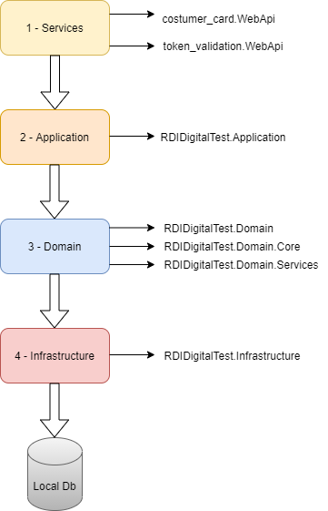

# RDIDigitalTest

DDD based project.

The project architecture is devided in 4 main labels: Services, Application, Domain and Infrastructure. The image down bellow represents the project schema:

Let's talk more specifically about every single layer.

*1 - Services:*
The first layer handles directly with the user - that's where the controllers are located. It only has HTTPs methods implementation, but without any business logic.

*2 - Application:*
The second layer is responsable for calling the service layer and handle with objects mapping - from DTO to entity object and from entity object to DTO. It contains 4 sublayers: TransferObjects, which contains the declaration of DTO for either request and response, Interfaces, which contains interfaces for Service layer calling, AutoMapper, responsible for mapping objects from DTO to entity object and vice versa, and ApplicationService, which contains the interface's implementation.

*3 - Domain:*
The domain concerns about any aspect around business and ubiquitous language. It's divided in:
    1 - Domain: which contains the entities for database
    2 - Domain Core: declares the interfaces for repository and domain services
    3 - Domain Services: Handles with data validation, business and implements the core interface.

*4 - Infrastructure:*
Handles with repositories interfaces implementation, creates the data context and the queries on database via Entity Framework Core. The infra's layer also deal with inversion of control around the application by dependency injections.
